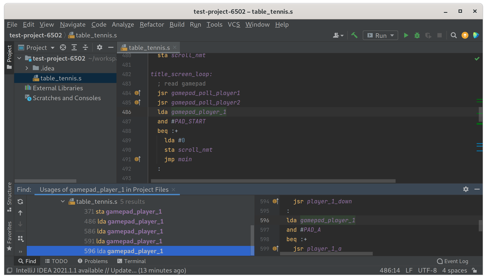

# 6502 Assembly Plugin for IntelliJ

This IntelliJ plugin provides basic support for 6502 assembly language. It is suitable for projects which use the `ca65` assembler to target the WDC 6502, 65816, and related microprocessors.

## Installation

This plugin is not currently published to the JetBrains Marketplace.

## License

This plugin may be used, distributed and modified under the terms of the MIT license, see [LICENSE](https://github.com/mike42/6502-assembly-intellij/blob/master/LICENSE) for details.

The parser/lexer were built with reference to the [ca65 assembler](https://github.com/cc65/cc65) source code (zlib License), while the icons are derived from those bundled with [JetBrains/intellij-community](https://github.com/JetBrains/intellij-community) (Apache License).

## Similar projects

I'm aware of these other plugins, which are for different assemblers.

- [4ch1m/kick-assembler-acbg](https://github.com/4ch1m/kick-assembler-acbg) - Kick Assembler
- [67726e/IntelliJ-6502](https://github.com/67726e/IntelliJ-6502) - NESASM
- [matozoid/Intellij6502](https://github.com/matozoid/Intellij6502) - 64tass

